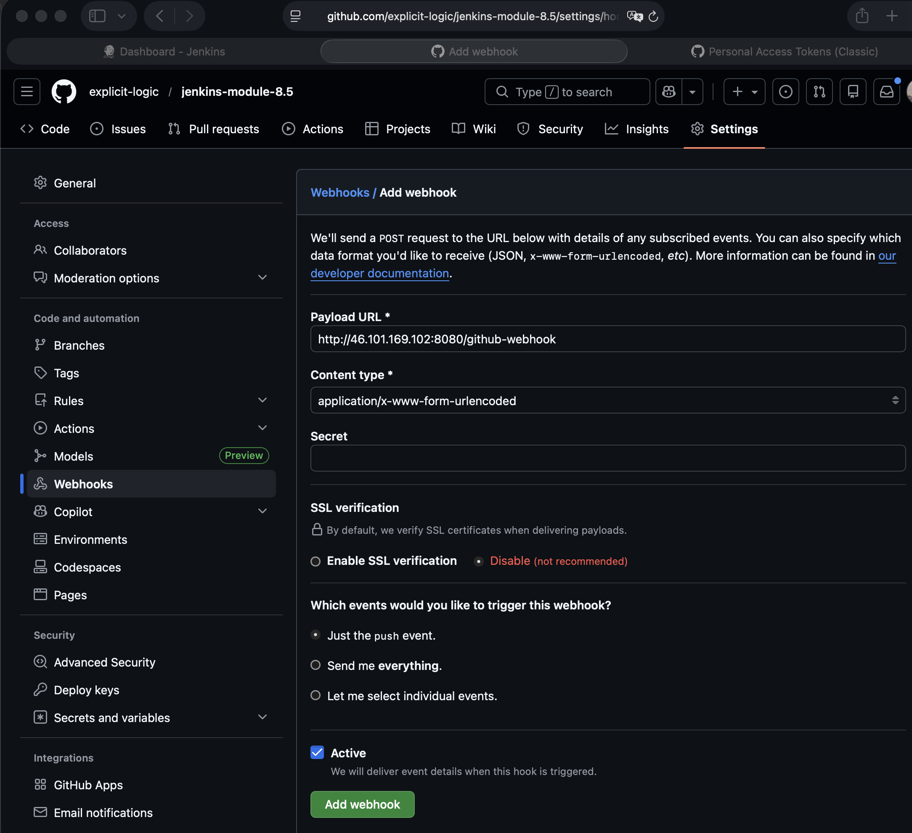

# Module 8 - Build Automation & CI/CD with Jenkins

This repository contains a demo project created as part of my **DevOps studies** in the **TechWorld with Nana – DevOps Bootcamp**.

https://www.techworld-with-nana.com/devops-bootcamp

***Demo Project:*** Dynamically Increment Application version in Jenkins Pipeline

***Technologies used:*** Jenkins, Docker, GitHub, Git, Java, Maven

***Project Description:*** 

- Configure CI step:Increment patch version
- Configure CI step: Build Java application and clean old artifacts
- Configure CI step: Build Image with dynamic Docker Image Tag
- Configure CI step: Push Image to private DockerHub repository
- Configure CI step: Commit version update of Jenkins back to Git repository
- Configure Jenkins pipeline to not trigger automatically on CI build commit to avoid commit loop

---

### Prerequisites

Before starting, complete all steps to configure Webhook to trigger CI Pipeline in Jenkins:

https://github.com/explicit-logic/jenkins-module-8.4

---

- Navigate to `Manage Jenkins` -> Plugins -> `Available Plugins`

- Install a jenkins plugin

Name: `Ignore Committer Strategy`

> This plugin provides addition configuration to prevent multi branch projects from triggering new builds based on a list of ignored email addresses.

See `app/script.groovy` for implementation of the folowing steps:

> - Configure CI step:Increment patch version
> - Configure CI step: Build Java application and clean old artifacts
> - Configure CI step: Build Image with dynamic Docker Image Tag
> - Configure CI step: Push Image to private DockerHub repository
> - Configure CI step: Commit version update of Jenkins back to Git repository

### Configure a Multibranch Pipeline

A multibranch pipeline automatically discovers branches and pull requests, creating a pipeline job for each.

### Create credentials

1. Navigate to `Manage Jenkins` -> Credentials

2. Add Credentials

Kind: `Username with password`

ID: `github`

Username: `<your github username (not email)>`

Password: `<your github personal token, starts with: ghp_>`

- Create a GitHub Personal Access Token

1. Navigate to https://github.com/settings/tokens/new
2. Set the **Note** to `jenkins`
3. Select the following scopes:

| Scope | Reason |
|---|---|
| `admin:repo_hook` | Create, read, and delete webhooks |
| `public_repo` | Access public repositories |
| `repo:status` | Update commit statuses |

#### Create the Multibranch Pipeline Job

1. Go to **Dashboard** → **New Item**
2. Name it `multibranch`, select **Multibranch Pipeline**, click **OK**

**Branch Sources:**
- Click **Add source** → **GitHub**

| Field | Value |
|---|---|
| Credentials | `github` |
| Repository HTTPS URL | `https://github.com/explicit-logic/jenkins-module-8.5` |

- Click **Validate** to confirm access

**Behaviors** — click **Add** and include:
- `Discover branches`
- `Discover pull requests from origin`

**Build strategies:**

1. Add `Ignore Committer Strategy`

List of author emails to ignore: `jenkins@example.com`

2. Check `Allow builds when a changeset contains non-ignored author(s)`

**Build Configuration:**
- Script Path: `Jenkinsfile`

**Scan Multibranch Pipeline Triggers:**
- Check **Periodically if not otherwise run** → set interval to `1 day`

3. Click **Save** — Jenkins will scan the repository and create jobs for each branch
